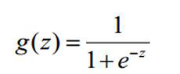

# 神经网络学习笔记

## 一、基础知识

### 1.1 K近邻算法（KNN）

K：近邻计算流程：

1. 计算已知类别数据集中的点与当前点的距离
2. 按照距离依次排序
3. 选取与当前点距离最小的K个点
4. 确定前K个点所在类别的出现概率
5. 返回前K个点出现频率最高的类别作为当前点预测分类

### 1.2 得分函数

$ f(x,W) = W*x+b$

### 1.3 损失函数

> 第i个类别的损失函数，其他类别的得分$s_j$减去正确类别的$s_y$的得分+1

> 正则化

正则化惩罚：

正则化惩罚项：

### 1.4 Softmax分类器

> 归一化处理

其中s为得分函数

计算损失值：

概率为0到1，取对数函数，损失为0到+∞

### 1.5 前向传播

计算得出损失值，交给反向传播

### 1.6 梯度下降

### 1.7 反向传播

通过反向偏导计算得到输入变量梯度的变化

- 加法门单元：均等分配

- max门单元：给最大的分配

- 乘法门单元：互换梯度

### 1.8 层次结构

### 1.9 激活函数

Sigmoid，Relu，Tanh等

### 1.10 参数初始化

### 1.11 DROP-OUT

杀死一部分神经元，防止网络模型过于复杂。

## 二、卷积神经网络

### 2.1 卷积网络

> 整体架构

- 输入层
- 卷积层
- 池化层
- 全连接层

> 卷积计算原理

输入的矩阵为$7*7*3$

权重矩阵，3*3为卷积核尺寸，深度为3应当与输入矩阵深度保持一致

$W_i$的个数为卷积核个数

> 卷积层涉及参数

- 步长 （图像通常为1）
- 卷积核尺寸 （最小通常为3*3）
- 边缘填充 （+pad 1）：弥补边缘信息被利用少的问题，以0为填充，不影响最后结果
- 卷积核个数

### 2.2 卷积结果计算公式

- 长度：

  

- 宽度：

  

  其中W1、H1表示输入的宽度、长度；W2、H2表示输出特征图的宽度、长度； 

  F表示卷积核长和宽的大小；S表示滑动窗口的步长;P表示边界填充(加几圈0)。

### 2.3 卷积参数共享

每一个filter的值在窗口滑动时不变，共享。

### 2.4 池化层

在原始特征上进行筛选，压缩，没有涉及到矩阵计算

> 最大池化：选择最大的值
>
> 平均池化：计算平均值（少见）

